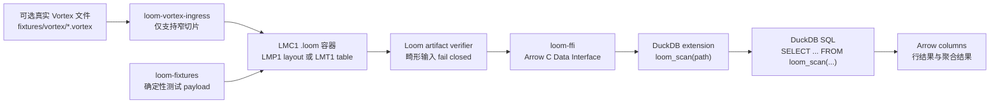
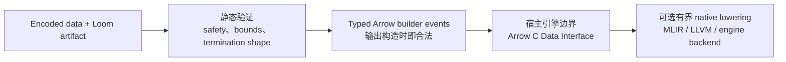

[English](README.md) | **中文**

<p align="center">
  
</p>

# Loom

Loom 是一个**面向分发的解码器 IR**：它不是通用执行环境，而是一门故意
受限、非图灵完备的解码描述语言，用来让解码逻辑随数据一起分发。它的成功
输出只能是良构的 Apache Arrow；任何不符合边界的 artifact 都应该在进入宿主
引擎前 fail closed。

当前仓库处于 MVP1 / v3 实现阶段。它可以生成多列 `.loom` 容器、验证容器、
经 Rust 与 C FFI 解码成 Arrow，并通过 DuckDB 的 `loom_scan(...)` 进行 SQL
查询。

## 当前已经具备的能力

| 领域 | 当前状态 |
|---|---|
| 容器 | `LMC1` 分发容器，可包装 `LMP1` 单列 payload 与 `LMT1` 表 payload |
| 编码 | Raw、bitpack、frame-of-reference、dictionary、RLE、FSST、dict-over-FSST、ALP Float32/Float64 |
| 验证 | container/layout/table verifier、full-verifier foundation、artifact verifier、Bitwuzla-backed SMT evidence |
| Arrow 边界 | Rust decode core 通过 Arrow C Data Interface 导出 Arrow-compatible arrays |
| DuckDB | C++ extension 暴露 `loom_scan('<artifact.loom>')`，覆盖 SQL smoke、mixed `LMC1` table payload，以及默认 `LMC2(LMA1)` Arrow semantic artifacts；full-projection primitive/nullable `LMC2(LMA1)` scan 在 MLIR/JIT backend 可用时默认走 production native codegen |
| Source compatibility | Parquet、Lance、Vortex 只要能由上游 reader materialize 成 Arrow，就可以生成 verifier-accepted `LMC2(LMA1)` semantic distribution artifact |
| Vortex ingress | legacy 窄范围 `.vortex` ingress 仍可将支持的非空 primitive/table case 转成已验证 `LMC1` |
| Native execution | production MLIR/LLVM/JIT native codegen 已能为 verifier-accepted `LMC2(LMA1)` / direct `LMA1` 的 one-batch nullable fixed-width primitive artifact，在 full projection、no predicate、full-scan split 条件下产出 Arrow value/validity buffers 与 RecordBatch；DuckDB 不再保留 `LMC1` raw-copy native 分支或 test-facts route |
| Verified lineage | accepted artifact 可以产出 safety provenance record，列出 verifier、solver、Lean、differential-validation evidence 与显式 TCB assumptions |

项目仍是 pre-production。当前策略是优先做窄而完整、由 verifier gate 保护的
纵向切片，而不是扩大未验证的格式覆盖面。

## DuckDB 数据流

DuckDB 路径是理解 Loom 最直观的入口：Loom artifact 作为数据分发，宿主先
验证再解码，DuckDB 最终看到普通的 Arrow-shaped columns。



在 smoke test 中，DuckDB 会加载 extension 并查询生成的 `.loom` fixtures：

```sql
LOAD 'duckdb-ext/build/loom.duckdb_extension';

SELECT id, flag, label
FROM loom_scan('target/loom-duckdb-fixtures/mixed-table.loom');

SELECT COUNT(*), SUM(id), COUNT(label)
FROM loom_scan('target/loom-duckdb-fixtures/mixed-table.loom');
```

## Quickstart

### 1. 构建并运行核心 Rust 检查

```bash
cargo test -p loom-core
cargo test -p loom-fixtures
```

### 2. 生成确定性的 Loom fixtures

```bash
cargo run -p loom-fixtures --bin emit_duckdb_payloads
ls target/loom-duckdb-fixtures
```

常用生成文件包括：

- `target/loom-duckdb-fixtures/bitpack-i32.loom`
- `target/loom-duckdb-fixtures/for-i32.loom`
- `target/loom-duckdb-fixtures/fsst-utf8.loom`
- `target/loom-duckdb-fixtures/alp-f64.loom`
- `target/loom-duckdb-fixtures/mixed-table.loom`

### 3. inspect、decode、verify 一个 artifact

```bash
cargo run --bin loom -- inspect target/loom-duckdb-fixtures/mixed-table.loom
cargo run --bin loom -- decode target/loom-duckdb-fixtures/mixed-table.loom
cargo run --bin loom -- verify-artifact target/loom-duckdb-fixtures/mixed-table.loom
```

安装 Bitwuzla 后，可以走 solver-backed artifact verification：

```bash
mise run external-tools
LOOM_REQUIRE_SOLVER=1 cargo run --bin loom -- \
  verify-artifact --solver-bitwuzla --l2core-sample \
  target/loom-duckdb-fixtures/bitpack-i32.loom
```

### 4. 运行 DuckDB SQL smoke test

```bash
bash scripts/duckdb-smoke-test.sh
```

这个脚本会生成 fixtures、构建 `loom-ffi`、构建
`duckdb-ext/build/loom.duckdb_extension`、在没有通过 `DUCKDB_CLI` 指定本地
DuckDB 时下载固定版本 CLI，并验证 `loom_scan(...)` 上的行结果与聚合结果。

### 5. 尝试窄范围 Vortex ingress

```bash
cargo run -p loom-vortex-ingress --bin emit_vortex_ingress_fixtures
cargo run --bin loom -- ingest-vortex --inspect fixtures/vortex/int32-flat.vortex
cargo run --bin loom -- ingest-vortex --emit-loom \
  fixtures/vortex/int32-flat.vortex /tmp/int32-flat.loom
cargo run --bin loom -- verify-artifact /tmp/int32-flat.loom
```

不支持的 Vortex layout 应该输出诊断并 fail closed，而不是静默生成无效 Loom
artifact。

### 6. 运行 full Arrow semantic source gate

```bash
bash scripts/full-arrow-semantic-compatibility-test.sh
```

这个 gate 验证 Phase 31 的语义路径：source reader 先 materialize Arrow batches，
Loom 将其编码为 Arrow semantic payload，artifact verifier 接受这些 bytes，
然后解码出的 Arrow batches 与 source/oracle Arrow batches 做等价比较。这是 source
compatibility claim，不代表 DuckDB SQL 或 native lowering 已支持所有 Arrow
nested/logical type。

### 7. 运行 LMC2 wrapper gate

```bash
bash scripts/lmc2-arrow-semantic-container-test.sh
```

这个 gate 验证 Phase 33 的分发 wrapper：source 默认路径和新的 source-ingress
`lmc2` 入口都会发 `LMC2(LMA1)`，artifact verifier 能识别 wrapper 并报告内部
Arrow semantic payload，CLI 报告继续把 native lowering 标成 unsupported，不把
wrapper acceptance 当成 native execution evidence。历史 `lma1` 命名入口继续发
direct `LMA1` bridge artifact，用作 regression evidence。

### 8. 运行 DuckDB source e2e gate

```bash
bash scripts/duckdb-source-e2e-test.sh
```

这个脚本会生成 Parquet、Lance、Vortex source fixtures，经各自 adapter crate
生成 verifier-accepted `LMC2(LMA1)` distribution artifact，并在 DuckDB
`loom_scan(...)` 上直接查询这些默认 artifact；显式 direct-`LMA1` bridge
fixtures 只作为 regression evidence 保留。

### 9. 运行 DuckDB LMC2 SQL surface gate

```bash
bash scripts/duckdb-lmc2-sql-surface-test.sh
```

这个 gate 验证 Phase 34 查询面：one-batch、multi-column、
primitive/Utf8/Boolean nullable 的 `LMC2(LMA1)` artifact 可以通过
`loom_scan(...)` 查询；Date32 logical 和 Struct nested fixtures 会以明确
unsupported diagnostics fail closed。Native Arrow semantic execution 由独立的
engine-neutral Phase 35 gate 覆盖，目前还没有被 DuckDB 消费。

### 10. 运行 native Arrow semantic execution gate

```bash
bash scripts/native-arrow-semantic-execution-test.sh
```

这个 gate 验证 Phase 35 native route：verifier-accepted `LMC2(LMA1)` 和显式
direct `LMA1` artifact 可以通过 engine-neutral backend 执行 one-batch nullable
`Boolean`、`Int32`、`Int64`、`Float32`、`Float64` columns。Utf8、logical、
nested、multi-batch、malformed、verifier-rejected 输入都会 fail closed。这是
native execution evidence，不是 DuckDB integration claim，也不是 full Arrow
shape support。

### 11. 运行 verified-lineage closeout gate

```bash
bash scripts/verified-lineage-test.sh
```

这个 gate 运行 MVP1.5 lineage matrix：Lean 0 `sorry`、Lean/Rust verifier
correspondence、model/Rust trace consistency、native/model validation，以及
verified-lineage record tests。`loom_core::verified_lineage` 只为 accepted
artifact 记录 safety provenance，列出 evidence layers 和 TCB assumptions；它
不声明 source correctness、verified compilation、end-to-end toolchain
verification、performance 或 production readiness。

### 12. 运行 production native-codegen stabilization gate

```bash
bash scripts/production-native-codegen-stabilization-test.sh
```

这个 gate 验证 Phase 43.2 的稳定化层，覆盖真实 Phase 43.1 MLIR/LLVM/JIT
路径。它会拒绝 native-tool skip evidence，检查 production/stabilization path
没有使用 zero-buffer placeholder，重跑 Phase 43.1 realization gate，并覆盖
replay/cache stability、production routing、adversarial output validation、
cancellation checkpoints、resource ownership 和 bounded soak evidence。

这个 claim 仍然刻意保持窄范围：只覆盖 one-batch nullable fixed-width
primitive 的 `LMC2(LMA1)` / direct `LMA1` artifact。它不是 verified
compilation，不是 persistent production cache，不是 DuckDB-native integration
claim，不是 general Arrow shape support，也不是 GA performance promise。

## 仓库结构

| 路径 | 用途 |
|---|---|
| `crates/loom-core` | 核心 layout/table/container codec、verifier、artifact verification、lowering facts |
| `crates/loom-ffi` | C ABI 边界与 Arrow C Data Interface export |
| `crates/loom-cli` | `loom inspect`、`decode`、`verify-artifact`、`verify-l2core`、`ingest-vortex` |
| `crates/loom-fixtures` | DuckDB 与 Rust test 使用的确定性 fixture/oracle 生成 |
| `crates/loom-vortex-ingress` | 隔离的真实 Vortex file ingress 边界 |
| `crates/loom-native-melior` | 可选 MLIR/melior/native-backend evidence path |
| `crates/loom-solver-smt` | 可选 SMT solver 集成，目前以 Bitwuzla 为主 |
| `duckdb-ext` | 暴露 `loom_scan(...)` 的 C++ DuckDB extension |
| `scripts` | Release gates 与聚焦 smoke tests |

## 设计形态

Loom 把 decoder distribution 与 host execution 分开：



关键分层：

- **L1 declarative layout** 描述物理结构：offsets、repetition、RLE、
  bitpacking、FOR、dictionary、table columns。
- **L2 total-function kernels** 只用于声明式 layout 表达不了的计算。
- **Verifier 负责安全与良构**，不单独证明语义正确性。安全但错误的 decoder
  仍需要 oracle tests、签名、校验和或 proof obligations。
- **Host 负责调度和执行策略**。Loom 提供已验证、目标中立的 decoder artifact；
  DuckDB、MLIR 或其他引擎决定如何执行。

## 验证入口

可以单独运行的聚焦 gate：

```bash
bash scripts/container-negative-test.sh
bash scripts/verifier-negative-test.sh
bash scripts/artifact-verifier-test.sh
bash scripts/complete-vortex-reader-test.sh
bash scripts/solver-verifier-test.sh
bash scripts/production-native-lowering-test.sh
bash scripts/full-arrow-semantic-compatibility-test.sh
bash scripts/lmc2-arrow-semantic-container-test.sh
bash scripts/duckdb-source-e2e-test.sh
bash scripts/native-arrow-semantic-execution-test.sh
```

更完整的 release-style gate：

```bash
bash scripts/mvp1-verify.sh
```

`scripts/mvp1-verify.sh` 会先运行继承的 `scripts/mvp0-verify.sh`，其中包括
full Arrow semantic、`LMC2(LMA1)` wrapper gate 和 DuckDB LMC2 SQL surface
gate，然后再运行 DuckDB source e2e gate 和 native Arrow semantic execution
gate。

形式化工具和外部工具是显式边界。Lean/TLC、LLVM/MLIR 或 Bitwuzla 缺失时，
默认不能算通过；只有调用方显式设置相应 opt-out 环境变量时，才允许跳过。

## 为什么需要 Loom

数据引擎已经能共享查询计划和列式内存，但还缺少一种小而稳定、易验证的方式
来让“解码器本身”随数据一起分发。Wasm、eBPF、LLVM IR 或 MLIR 这类通用执行
格式，要么过于通用，要么过于贴近宿主，要么默认信任输入，因此都会把复杂度
带到分发边界上。

Loom 的赌注更窄：让分发层小到可验证、全函数到可证明终止、Arrow-shaped 到
宿主引擎可以直接消费结果，而不必永远内置每一种源格式的 reader。
