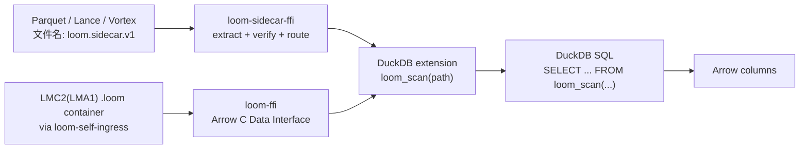

[English](README.md) | **中文**

<p align="center">
  
</p>

# Loom

Loom 是一个**面向分发的解码器 IR**：它不是通用执行环境，而是一门故意
受限、非图灵完备的解码描述语言，用来让解码逻辑随数据一起分发。它的成功
输出只能是良构的 Apache Arrow；任何不符合边界的 artifact 都应该在进入宿主
引擎前 fail closed。

主要的集成方式是 **sidecar overlay**：将 Loom IR 程序作为可剥离的元数据嵌入
已有的 Parquet、Lance 或 Vortex 文件中。DuckDB extension 读取 sidecar，验证
content-hash 身份，然后通过 Loom-native decode 路径执行，或 fallback 到
host-native reader 上——全过程无需引入新的文件格式。

## Quickstart: Sidecar + DuckDB

最快速的体验路径：将 Loom IR 嵌入 Parquet 文件，通过 DuckDB 查询。

### 1. 构建 lean CLI（无 container 依赖）

```bash
cargo build -p loom-cli --no-default-features --release
```

`sidecar embed` 命令在不需要完整 `loom-container` 栈的情况下即可编译。

### 2. 将 Loom IR 程序嵌入 Parquet 文件

```bash
cargo run -p loom-cli --no-default-features -- \
  sidecar embed --source data.parquet --ir program.l2ir
```

这会在 Parquet 文件中添加 `loom.sidecar.v1` 以及每个列的 `loom.hash.*`
KeyValue 元数据。sidecar 是**纯增量**的——原始 Parquet 数据不会被修改，
未知的 `loom.*` key 会被标准 Arrow reader 静默忽略。

### 3. 构建 DuckDB extension（sidecar-only 模式）

```bash
cd contrib/duckdb-ext
mkdir -p build && cd build
cmake .. -DLOOM_SIDECAR_ONLY=ON
make -j$(nproc)
```

`LOOM_SIDECAR_ONLY=ON` 链接 `libloom_sidecar_ffi.a`（lean 路径，零 container
依赖），而非 `libloom_ffi.a`（完整的 `.loom` container 路径）。

### 4. 通过 DuckDB 查询

```sql
LOAD 'contrib/duckdb-ext/build/loom.duckdb_extension';

SELECT * FROM loom_scan('data.parquet');
```

DuckDB 看到的是普通的 Arrow 列。底层 extension 会提取 sidecar，运行 4 道闸门
路由决策，要么通过 Loom 解码，要么 fallback 到 host-native reader 并附带类型化
的诊断信息。

### 5. Sidecar + Lance / Vortex

其他宿主格式同理：

```bash
# Lance
cargo run -p loom-cli --no-default-features -- \
  sidecar embed --source data.lance --ir program.l2ir --host lance

# Vortex
cargo run -p loom-cli --no-default-features -- \
  sidecar embed --source data.vortex --ir program.l2ir --host vortex
```

Lance 和 Vortex adapter 已实现，并记录了格式限制（Lance 7.0.0 manifest 和
Vortex 0.74.0 footer 缺少通用元数据字典；adapter 在 extract 时返回
`Ok(None)` 并注明限制）。

### 6. 运行 sidecar release gate

```bash
bash scripts/sidecar-overlay-test.sh
```

## 当前已经具备的能力

| 领域 | 当前状态 |
|---|---|
| Sidecar overlay | `SidecarOverlay`/`ChunkBinding`，带确定性 encode/decode 和 content-hash identity（FNV-1a）；4-gate fail-closed routing（`decide_sidecar_routing`）——Loom-native vs host-native fallback 带类型化诊断 |
| Sidecar + Parquet | 通过 Thrift `KeyValue` 元数据实现真实的 extract/embed；可被标准 Arrow reader 剥离 |
| Sidecar + Lance/Vortex | 已提供 adapter，记录格式限制 |
| Lean FFI | `loom-sidecar-ffi` staticlib 提供 C ABI（extract、verify、route、free）；零 `loom-container` 依赖 |
| DuckDB | C++ extension；`LOOM_SIDECAR_ONLY=ON` 时针对 sidecar 嵌入的宿主文件走 lean FFI；完整路径处理 `.loom` container 文件 |
| Container（`.loom`） | `LMC2(LMA1)` 分发 artifact；`loom-self-ingress` 处理 IO |
| 编码 | Raw、bitpack、frame-of-reference、dictionary、RLE、FSST、dict-over-FSST、ALP Float32/Float64 |
| 验证 | Container/layout/table verifier、full-verifier foundation、artifact verifier、SMT-ready constraint IR |
| Arrow 边界 | Arrow C Data Interface 导出 |
| Verified lineage | Safety provenance record 列出 verifier、solver、Lean、differential-validation evidence 与 TCB assumptions |

## DuckDB 数据流



两条路径，一个 DuckDB 入口：
- **Sidecar 路径**（lean）：宿主文件 → `loom-sidecar-ffi` → 路由闸门 → Loom 解码或 host-native fallback
- **Container 路径**（full）：`.loom` 文件 → `loom-ffi` → `loom-container` → Arrow

## Container Quickstart（`.loom` 文件）

传统的 `.loom` container 路径仍然可用。

### 生成 fixtures

```bash
cargo run -p loom-fixtures --bin emit_duckdb_payloads
ls target/loom-duckdb-fixtures
```

### 构建完整 DuckDB extension

```bash
cd contrib/duckdb-ext && mkdir -p build && cd build
cmake .. -DLOOM_SIDECAR_ONLY=OFF
make -j$(nproc)
```

### 查询

```sql
LOAD 'contrib/duckdb-ext/build/loom.duckdb_extension';

SELECT id, flag, label
FROM loom_scan('target/loom-duckdb-fixtures/mixed-table.loom');
```

### inspect、decode、verify

```bash
cargo run -p loom-cli -- inspect target/loom-duckdb-fixtures/mixed-table.loom
cargo run -p loom-cli -- decode target/loom-duckdb-fixtures/mixed-table.loom
cargo run -p loom-cli -- verify-artifact target/loom-duckdb-fixtures/mixed-table.loom
```

## 仓库结构

| 路径 | 用途 |
|---|---|
| `crates/loom-ir-core` | 零依赖解码 IR 核心 — `SidecarOverlay`、`ChunkBinding`、routing、content-hash |
| `crates/loom-sidecar-ffi` | Lean C ABI，用于 sidecar extract/verify/route（零 container 依赖） |
| `crates/loom-container` | `.loom` 格式层 — codecs、verifier、native lowering、lineage |
| `crates/loom-self-ingress` | `.loom` 文件 IO 边界（read/write/verify） |
| `crates/loom-core` | 薄 re-export shim，委托 `loom-ir-core` + `loom-container` |
| `crates/loom-ffi` | 完整 C ABI 与 Arrow C Data Interface（container 路径） |
| `crates/loom-cli` | CLI；lean 模式（`--no-default-features`）用于 sidecar embed，full 模式用于 container 操作 |
| `crates/loom-fixtures` | 确定性 fixture/oracle 生成 |
| `ingress/loom-parquet-ingress` | Parquet ingress，带 sidecar extract/embed |
| `ingress/loom-vortex-ingress` | Vortex ingress，带 sidecar adapter |
| `ingress/loom-lance-ingress` | Lance ingress，带 sidecar adapter |
| `crates/loom-native-melior` | 可选 MLIR/melior/native-backend evidence path |
| `contrib/duckdb-ext` | C++ DuckDB extension |
| `scripts` | Release gates 与聚焦 smoke tests |

## 设计形态

```
Parquet/Lance/Vortex      .loom container
       │                       │
       ▼                       ▼
loom-sidecar-ffi         loom-self-ingress
  (lean, 0 container)       (full path)
       │                       │
       ▼                       ▼
  4-gate routing          loom-container
  Loom decode /            codecs + verifier
  host-native fallback
       │                       │
       └───────┬───────────────┘
               ▼
       DuckDB / Arrow consumer
```

- **Sidecar 路径**：将 Loom IR 嵌入已有文件，让 DuckDB 在查询时决定执行路径。
- **Container 路径**：当你需要端到端控制格式时使用完整的 `.loom` 分发。

## 验证入口

```bash
bash scripts/sidecar-overlay-test.sh
bash scripts/container-negative-test.sh
bash scripts/verifier-negative-test.sh
bash scripts/artifact-verifier-test.sh
bash scripts/full-arrow-semantic-compatibility-test.sh
bash scripts/lmc2-arrow-semantic-container-test.sh
bash scripts/native-arrow-semantic-execution-test.sh
```

更完整的 release gate：

```bash
bash scripts/mvp1-verify.sh
```

## 为什么需要 Loom

数据引擎已经能共享查询计划和列式内存，但还缺少一种小而稳定、易验证的方式
来让"解码器本身"随数据一起分发。Wasm、eBPF、LLVM IR 或 MLIR 这类通用执行
格式，要么过于通用，要么过于贴近宿主，要么默认信任输入，因此都会把复杂度
带到分发边界上。

Loom 的赌注更窄：让分发层小到可验证、全函数到可证明终止、Arrow-shaped 到
宿主引擎可以直接消费结果，而不必永远内置每一种源格式的 reader。
