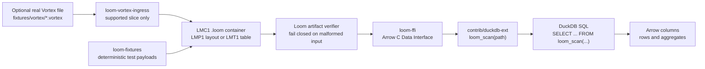
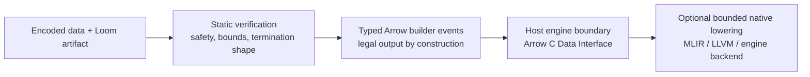

**English** | [中文](README-zh.md)

<p align="center">
  
</p>

# Loom

Loom is a **distribution-oriented decoder IR**: a deliberately non-general,
non-Turing-complete language for shipping decoder logic with data. Its only
successful output is well-formed Apache Arrow, and every artifact is meant to
fail closed before it reaches a host engine.

The current repository is an MVP1 / v3 track implementation. It can build
multi-column `.loom` containers, verify them, decode them to Arrow through Rust
and C FFI, and query them from DuckDB through `loom_scan(...)`.

## What Works Today

| Area | Current state |
|---|---|
| Container | `LMC2(LMA1)` is the default distribution artifact; legacy `LMC1` wrapping `LMP1`/`LMT1` remains for internal coverage tests |
| Encodings | Raw, bitpack, frame-of-reference, dictionary, RLE, FSST, dict-over-FSST, ALP Float32/Float64 |
| Verification | Container/layout/table verifier, full-verifier foundation, artifact verifier, Bitwuzla-backed SMT evidence |
| Arrow boundary | Rust decode core exports Arrow-compatible arrays through the Arrow C Data Interface |
| DuckDB | C++ extension in `contrib/duckdb-ext` exposes `loom_scan('<artifact.loom>')` for SQL smoke coverage over default `LMC2(LMA1)` Arrow semantic artifacts; interpreter fallback is disabled by default and requires explicit `LOOM_DUCKDB_ALLOW_INTERPRETER_FALLBACK=1` |
| Source compatibility | Parquet, Lance, and Vortex sources that materialize as Arrow can emit verifier-accepted `LMC2(LMA1)` semantic distribution artifacts |
| Vortex ingress | Real `.vortex` files enter through `loom-vortex-ingress` and emit verifier-accepted `LMC2(LMA1)` by default; legacy `LMC1` emission helpers are internal-only |
| Native execution | Native MLIR/LLVM/JIT path is gated behind Phase 40 validation; raw-copy kernel and decode dialect op have been removed from core production modules pending that gate. Phase 35 Arrow semantic JIT evidence remains in `loom-native-melior` |
| Verified lineage | Accepted artifacts can produce a safety provenance record naming verifier, solver, Lean, differential-validation evidence, and explicit TCB assumptions |

This is still pre-production. The project favors narrow, verifier-gated vertical
slices over broad unverified format support.

## DuckDB Data Flow

The DuckDB path is the easiest way to understand the project: Loom artifacts
travel as data, the host verifies and decodes them, and DuckDB sees ordinary
Arrow-shaped columns.



In the smoke test, DuckDB loads the extension and queries generated `.loom`
fixtures:

```sql
LOAD 'contrib/contrib/duckdb-ext/build/loom.duckdb_extension';

SELECT id, flag, label
FROM loom_scan('target/loom-duckdb-fixtures/mixed-table.loom');

SELECT COUNT(*), SUM(id), COUNT(label)
FROM loom_scan('target/loom-duckdb-fixtures/mixed-table.loom');
```

## Quickstart

### 1. Build and run focused Rust checks

```bash
cargo test -p loom-core
cargo test -p loom-fixtures
```

### 2. Generate deterministic Loom fixtures

```bash
cargo run -p loom-fixtures --bin emit_duckdb_payloads
ls target/loom-duckdb-fixtures
```

Useful generated files include:

- `target/loom-duckdb-fixtures/bitpack-i32.loom`
- `target/loom-duckdb-fixtures/for-i32.loom`
- `target/loom-duckdb-fixtures/fsst-utf8.loom`
- `target/loom-duckdb-fixtures/alp-f64.loom`
- `target/loom-duckdb-fixtures/mixed-table.loom`

### 3. Inspect, decode, and verify an artifact

```bash
cargo run --bin loom -- inspect target/loom-duckdb-fixtures/mixed-table.loom
cargo run --bin loom -- decode target/loom-duckdb-fixtures/mixed-table.loom
cargo run --bin loom -- verify-artifact target/loom-duckdb-fixtures/mixed-table.loom
```

Solver-backed verification is available when Bitwuzla is installed through the
managed external-tool path:

```bash
mise run external-tools
LOOM_REQUIRE_SOLVER=1 cargo run --bin loom -- \
  verify-artifact --solver-bitwuzla --l2core-sample \
  target/loom-duckdb-fixtures/bitpack-i32.loom
```

### 4. Run the DuckDB SQL smoke test

```bash
bash scripts/duckdb-smoke-test.sh
```

The script generates fixtures, builds `loom-ffi`, builds
`contrib/duckdb-ext/build/loom.duckdb_extension`, downloads a pinned DuckDB CLI if one
is not supplied through `DUCKDB_CLI`, and checks row/aggregate SQL results over
`loom_scan(...)`.

### 5. Try the narrow Vortex ingress slice

```bash
cargo run -p loom-vortex-ingress --bin emit_vortex_ingress_fixtures
cargo run --bin loom -- ingest-vortex --inspect fixtures/vortex/int32-flat.vortex
cargo run --bin loom -- ingest-vortex --emit-loom \
  fixtures/vortex/int32-flat.vortex /tmp/int32-flat.loom
cargo run --bin loom -- verify-artifact /tmp/int32-flat.loom
```

Unsupported Vortex layouts are expected to report diagnostics and fail closed,
not silently emit invalid Loom artifacts.

### 6. Run the full Arrow semantic source gate

```bash
bash scripts/full-arrow-semantic-compatibility-test.sh
```

This verifies the Phase 31 semantic path: source readers materialize Arrow
batches, Loom encodes them as Arrow semantic payloads, the artifact verifier
accepts the bytes, and decoded batches compare equal to the source/oracle Arrow
batches.
This is a source compatibility claim, not a claim that DuckDB SQL or native
lowering supports every Arrow nested or logical type.

### 7. Run the LMC2 wrapper gate

```bash
bash scripts/lmc2-arrow-semantic-container-test.sh
```

This verifies the Phase 33 distribution wrapper: source defaults and the
new source-ingress `lmc2` entrypoints emit `LMC2(LMA1)`, the artifact verifier
recognizes the wrapper and reports the inner Arrow semantic payload, and CLI
reports keep native lowering unsupported instead of turning wrapper acceptance
into native execution evidence. Direct `LMA1` bridge entrypoints have been
removed from the public API; only `LMC2(LMA1)` remains as the default.

### 8. Run the DuckDB LMC2 SQL surface gate

```bash
bash scripts/duckdb-lmc2-sql-surface-test.sh
```

This verifies the Phase 34 query surface: one-batch, multi-column
primitive/Utf8/Boolean nullable `LMC2(LMA1)` artifacts work through
`loom_scan(...)`, while Date32 logical and Struct nested fixtures fail closed
with explicit unsupported diagnostics. Native Arrow semantic execution is
covered by the separate engine-neutral Phase 35 gate and is not consumed by
DuckDB yet.

### 9. Run the native Arrow semantic execution gate

```bash
bash scripts/native-arrow-semantic-execution-test.sh
```

This verifies the Phase 35 native route: verifier-accepted `LMC2(LMA1)`
artifacts execute through an engine-neutral backend for one-batch nullable
`Boolean`, `Int32`, `Int64`, `Float32`, and `Float64` columns. Utf8, logical,
nested, multi-batch, malformed, and verifier-rejected inputs fail closed.
The raw-copy kernel has been removed from the core production path; native
execution is gated behind Phase 40 validation.

### 10. Run the verified-lineage closeout gate

```bash
bash scripts/verified-lineage-test.sh
```

This runs the MVP1.5 lineage matrix: Lean with zero `sorry`, Lean/Rust verifier
correspondence, model/Rust trace consistency, native/model validation, and
verified-lineage record tests. `loom_core::verified_lineage` records safety
provenance for accepted artifacts only. It names evidence layers and TCB
assumptions; it does not claim source correctness, verified compilation,
end-to-end toolchain verification, performance, or production readiness.

### 11. Run the production native-codegen stabilization gate

```bash
bash scripts/production-native-codegen-stabilization-test.sh
```

This verifies the Phase 43.2 stabilization layer over the real Phase 43.1
MLIR/LLVM/JIT path. It rejects native-tool skip evidence, checks that the
production/stabilization path does not use zero-buffer placeholders, reruns the
Phase 43.1 realization gate, and covers replay/cache stability, production
routing, adversarial output validation, cancellation checkpoints, resource
ownership, and bounded soak evidence.

The claim remains intentionally narrow: one-batch nullable fixed-width primitive
`LMC2(LMA1)` artifacts only. This is not verified compilation,
not a persistent production cache, not a DuckDB-native integration claim, not
general Arrow shape support, and not a GA performance promise.

## Repository Map

| Path | Purpose |
|---|---|
| `crates/loom-core` | Core layout/table/container codecs, verifier, artifact verification, lowering facts |
| `crates/loom-ffi` | C ABI boundary and Arrow C Data Interface export |
| `crates/loom-cli` | `loom inspect`, `decode`, `verify-artifact`, `verify-l2core`, `ingest-vortex` |
| `crates/loom-fixtures` | Deterministic fixture/oracle generation for DuckDB and Rust tests |
| `crates/loom-vortex-ingress` | Isolated real Vortex file ingress boundary |
| `crates/loom-native-melior` | Optional MLIR/melior/native-backend evidence path |
| `crates/loom-solver-smt` | Optional SMT solver integration, currently Bitwuzla-primary |
| `contrib/duckdb-ext` | C++ DuckDB extension exposing `loom_scan(...)` |
| `contrib/loom-iceberg-binding` | Iceberg binding placeholder (moved to contrib) |
| `contrib/loom-dual-query-surface` | Dual-query surface placeholder (moved to contrib) |
| `scripts` | Release gates and focused smoke tests |

## Design Shape

Loom separates decoder distribution from host execution:



The important split:

- **L1 declarative layout** describes physical structure: offsets, repetition,
  RLE, bitpacking, FOR, dictionary, table columns.
- **L2 total-function kernels** are reserved for compute that cannot be
  expressed declaratively.
- **The verifier owns safety and well-formedness**, not semantic truth. Wrong
  but safe decoders still require oracle tests, signatures, checksums, or proof
  obligations.
- **The host owns scheduling and execution strategy**. Loom supplies a verified,
  target-neutral decoder artifact; DuckDB, MLIR, or another engine decides how
  to run it.

## Verification Gates

Focused gates can be run individually:

```bash
bash scripts/container-negative-test.sh
bash scripts/verifier-negative-test.sh
bash scripts/artifact-verifier-test.sh
bash scripts/complete-vortex-reader-test.sh
bash scripts/solver-verifier-test.sh
bash scripts/production-native-lowering-test.sh
bash scripts/full-arrow-semantic-compatibility-test.sh
bash scripts/lmc2-arrow-semantic-container-test.sh
bash scripts/native-arrow-semantic-execution-test.sh
```

The broad release-style gate is:

```bash
bash scripts/mvp1-verify.sh
```

`scripts/mvp1-verify.sh` runs the inherited `scripts/mvp0-verify.sh` gate first,
including the full Arrow semantic, `LMC2(LMA1)` wrapper, and DuckDB LMC2 SQL
surface gates, then runs the DuckDB source e2e gate and the native Arrow
semantic execution gate.

Formal and external tooling is explicit. Missing Lean/TLC, LLVM/MLIR, or
Bitwuzla is not treated as success unless the corresponding opt-out environment
variable is deliberately set by the caller.

## Why Loom Exists

Data engines already share query plans and columnar memory. They do not have a
small, durable, verifier-friendly way to share the decoder itself with the data.
General execution formats such as Wasm, eBPF, LLVM IR, or MLIR each carry costs
that come from being too general, too host-specific, or too trusted by default.

Loom's bet is narrower: make the distributed layer small enough to verify, total
enough to terminate, and Arrow-shaped enough that a host engine can consume the
result without learning every source format forever.
