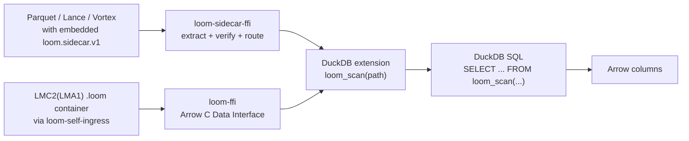

**English** | [中文](README-zh.md)

<p align="center">
  
</p>

# Loom

Loom is a **distribution-oriented decoder IR**: a deliberately non-general,
non-Turing-complete language for shipping decoder logic with data. Its only
successful output is well-formed Apache Arrow, and every artifact is meant to
fail closed before it reaches a host engine.

The primary integration model is the **sidecar overlay**: embed a Loom IR
program as strippable metadata in an existing Parquet, Lance, or Vortex file.
The DuckDB extension reads the sidecar, verifies content-hash identity, and
routes through the Loom-native decode path or falls back to the host-native
reader — all without introducing a new file format.

## Quickstart: Sidecar + DuckDB

The fastest path: embed Loom IR into a Parquet file, query it through DuckDB.

### 1. Build the lean CLI (no container dependency)

```bash
cargo build -p loom-cli --no-default-features --release
```

The `sidecar embed` command compiles without the full `loom-container` stack.

### 2. Embed a Loom IR program into a Parquet file

```bash
cargo run -p loom-cli --no-default-features -- \
  sidecar embed --source data.parquet --ir program.l2ir
```

This adds `loom.sidecar.v1` and per-column `loom.hash.*` KeyValue metadata to
the Parquet file. The sidecar is **additive only** — the original Parquet data
is untouched, and unknown `loom.*` keys are silently ignored by standard Arrow
readers.

### 3. Build the DuckDB extension (sidecar-only mode)

```bash
cd contrib/duckdb-ext
mkdir -p build && cd build
cmake .. -DLOOM_SIDECAR_ONLY=ON
make -j$(nproc)
```

`LOOM_SIDECAR_ONLY=ON` links against `libloom_sidecar_ffi.a` (lean path, zero
container dependency) instead of `libloom_ffi.a` (full `.loom` container path).

### 4. Query through DuckDB

```sql
LOAD 'contrib/duckdb-ext/build/loom.duckdb_extension';

SELECT * FROM loom_scan('data.parquet');
```

DuckDB sees ordinary Arrow columns. Under the hood, the extension extracts the
sidecar, runs the 4-gate routing decision, and either decodes through Loom or
falls back to the host-native reader with typed diagnostics.

### 5. Sidecar + Lance / Vortex

Same pattern for other host formats:

```bash
# Lance
cargo run -p loom-cli --no-default-features -- \
  sidecar embed --source data.lance --ir program.l2ir --host lance

# Vortex
cargo run -p loom-cli --no-default-features -- \
  sidecar embed --source data.vortex --ir program.l2ir --host vortex
```

Lance and Vortex adapters are present with documented format limitations
(Lance 7.0.0 manifest and Vortex 0.74.0 footer lack general-purpose metadata
dictionaries; the adapters return graceful `Ok(None)` for extract, documenting
the limitation).

### 6. Run the sidecar release gate

```bash
bash scripts/sidecar-overlay-test.sh
```

## What Works Today

| Area | Current state |
|---|---|
| Sidecar overlay | `SidecarOverlay`/`ChunkBinding` with deterministic encode/decode and content-hash identity (FNV-1a); 4-gate fail-closed routing (`decide_sidecar_routing`) — Loom-native vs host-native fallback with typed diagnostics |
| Sidecar + Parquet | Real extract/embed via Thrift `KeyValue` metadata; strippable by standard Arrow readers |
| Sidecar + Lance/Vortex | Thin adapters with documented format limitations |
| Lean FFI | `loom-sidecar-ffi` staticlib with C ABI (extract, verify, route, free); zero dependency on `loom-container` |
| DuckDB | C++ extension; `LOOM_SIDECAR_ONLY=ON` builds against the lean FFI for sidecar-embedded host files; full path for `.loom` container files |
| Container (`.loom`) | `LMC2(LMA1)` distribution artifact; `loom-self-ingress` handles IO |
| Encodings | Raw, bitpack, frame-of-reference, dictionary, RLE, FSST, dict-over-FSST, ALP Float32/Float64 |
| Verification | Container/layout/table verifier, full-verifier foundation, artifact verifier, SMT-ready constraint IR |
| Arrow boundary | Arrow C Data Interface export |
| Verified lineage | Safety provenance record naming verifier, solver, Lean, differential-validation evidence, and TCB assumptions |

## DuckDB Data Flow



Two paths, one DuckDB surface:
- **Sidecar path** (lean): host file → `loom-sidecar-ffi` → routing gate → Loom decode or host-native fallback
- **Container path** (full): `.loom` file → `loom-ffi` → `loom-container` → Arrow

## Container Quickstart (`.loom` files)

The legacy `.loom` container path remains available.

### Generate fixtures

```bash
cargo run -p loom-fixtures --bin emit_duckdb_payloads
ls target/loom-duckdb-fixtures
```

### Build the full DuckDB extension

```bash
cd contrib/duckdb-ext && mkdir -p build && cd build
cmake .. -DLOOM_SIDECAR_ONLY=OFF
make -j$(nproc)
```

### Query

```sql
LOAD 'contrib/duckdb-ext/build/loom.duckdb_extension';

SELECT id, flag, label
FROM loom_scan('target/loom-duckdb-fixtures/mixed-table.loom');
```

### Inspect, decode, verify

```bash
cargo run -p loom-cli -- inspect target/loom-duckdb-fixtures/mixed-table.loom
cargo run -p loom-cli -- decode target/loom-duckdb-fixtures/mixed-table.loom
cargo run -p loom-cli -- verify-artifact target/loom-duckdb-fixtures/mixed-table.loom
```

## Repository Map

| Path | Purpose |
|---|---|
| `crates/loom-ir-core` | Zero-dependency decode IR core — `SidecarOverlay`, `ChunkBinding`, routing, content-hash |
| `crates/loom-sidecar-ffi` | Lean C ABI for sidecar extract/verify/route (zero container dependency) |
| `crates/loom-container` | `.loom` format layer — codecs, verifier, native lowering, lineage |
| `crates/loom-self-ingress` | `.loom` file IO boundary (read/write/verify) |
| `crates/loom-core` | Thin re-export shim for `loom-ir-core` + `loom-container` |
| `crates/loom-ffi` | Full C ABI and Arrow C Data Interface (container path) |
| `crates/loom-cli` | CLI; lean mode (`--no-default-features`) for sidecar embed, full mode for container ops |
| `crates/loom-fixtures` | Deterministic fixture/oracle generation |
| `ingress/loom-parquet-ingress` | Parquet ingress with sidecar extract/embed |
| `ingress/loom-vortex-ingress` | Vortex ingress with sidecar adapter |
| `ingress/loom-lance-ingress` | Lance ingress with sidecar adapter |
| `crates/loom-native-melior` | Optional MLIR/melior/native-backend evidence path |
| `contrib/duckdb-ext` | C++ DuckDB extension |
| `scripts` | Release gates and focused smoke tests |

## Design Shape

```
Parquet/Lance/Vortex      .loom container
       │                       │
       ▼                       ▼
loom-sidecar-ffi         loom-self-ingress
  (lean, 0 container)       (full path)
       │                       │
       ▼                       ▼
  4-gate routing          loom-container
  Loom decode /            codecs + verifier
  host-native fallback
       │                       │
       └───────┬───────────────┘
               ▼
       DuckDB / Arrow consumer
```

- **Sidecar path**: Embed Loom IR in existing files, let DuckDB decide at query time.
- **Container path**: Full `.loom` distribution for when you control the format end-to-end.

## Verification Gates

```bash
bash scripts/sidecar-overlay-test.sh
bash scripts/container-negative-test.sh
bash scripts/verifier-negative-test.sh
bash scripts/artifact-verifier-test.sh
bash scripts/full-arrow-semantic-compatibility-test.sh
bash scripts/lmc2-arrow-semantic-container-test.sh
bash scripts/native-arrow-semantic-execution-test.sh
```

The broad release gate:

```bash
bash scripts/mvp1-verify.sh
```

## Why Loom Exists

Data engines already share query plans and columnar memory. They do not have a
small, durable, verifier-friendly way to share the decoder itself with the data.
General execution formats such as Wasm, eBPF, LLVM IR, or MLIR each carry costs
that come from being too general, too host-specific, or too trusted by default.

Loom's bet is narrower: make the distributed layer small enough to verify, total
enough to terminate, and Arrow-shaped enough that a host engine can consume the
result without learning every source format forever.
